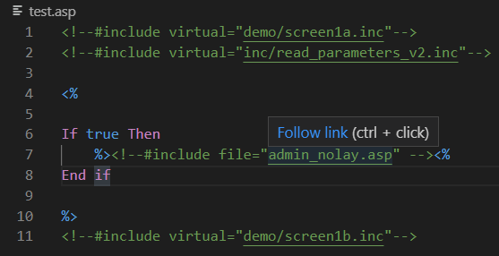

# ASP fellow

This is a Visual Studio Code extension to help with Classic ASP development.

## Features

Press `CTRL+Click` on the include file to open that file.

Example of the plugin in action

> Tip: both `virtual` and `file` includes are supported.

