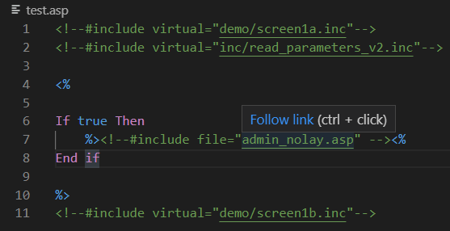
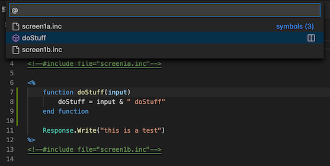

# ASP fellow

This is a Visual Studio Code extension to help with Classic ASP development.

## Go to include files

Press `CTRL+Click` or `F12` on the include file to open that file.

Example of the plugin in action

> Tip: both `virtual` and `file` includes are supported.

## Go to symbols in document
Press `CTRL+Shift+O` or `CMD+Shift+O` to list the include files or methods in the current document.

Example of the plugin in action

